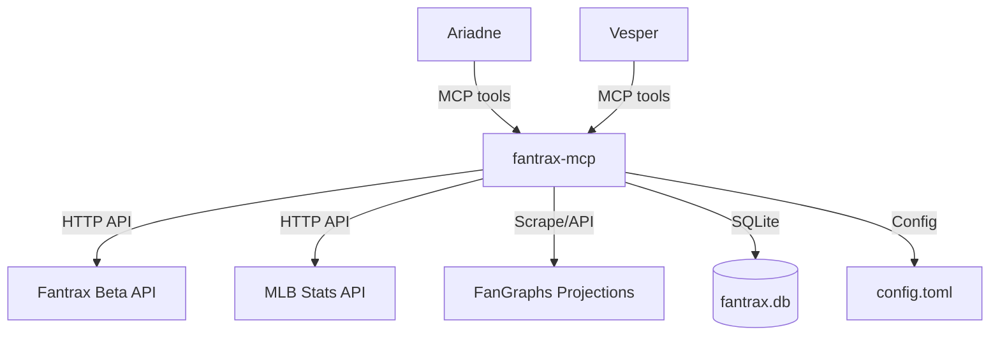
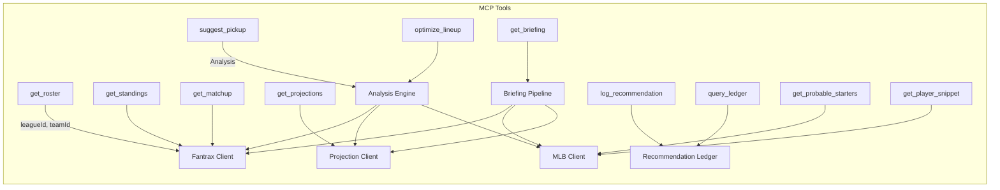
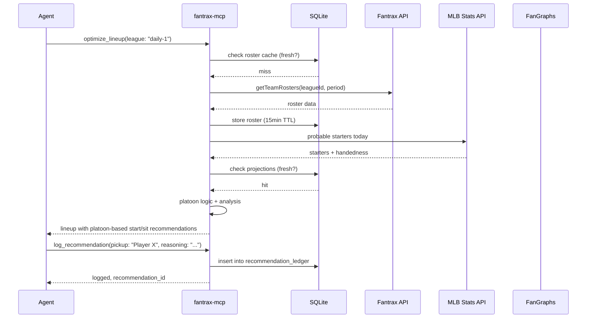

<!-- design-meta
status: draft
last-updated: 2026-05-26
phase: 3
-->

# Architecture: Fantrax Fantasy Baseball MCP Server

## Overview

A Rust MCP server (streamable HTTP via rmcp + Axum) that wraps Fantrax's beta API, MLB's Stats API, and third-party projection sources into agent-friendly tools. Read-only. Shared SQLite data layer. Independent analysis per agent. Caches aggressively to minimize external API calls.

## Component Decomposition

### MCP Server (rmcp + Axum)
- Streamable HTTP transport, same pattern as memory-mcp
- Tool dispatch: roster, standings, matchup, projections, suggest_pickup, optimize_lineup, briefing, ledger
- Multi-league aware: all tools accept a league identifier

### Fantrax Client
- HTTP client wrapping the beta API endpoints
- Auth: userSecretId passed as query parameter
- Endpoints: getLeagues (auto-discovery), getTeamRosters, getStandings, getLeagueInfo, getPlayerIds
- League auto-discovery: on startup or refresh, call getLeagues to enumerate all leagues for the user

### MLB API Client
- Wraps MLB Stats API (statsapi.mlb.com) -- no auth required
- Probable starters: daily schedule with probable pitchers and handedness
- Box scores: game results, individual player lines
- Player metadata: batter/pitcher handedness for platoon logic
- Used for: daily platoon decisions, morning briefing "what happened" layer, player snippets

### Projection Client
- Pulls player projections from FanGraphs (scraping or API)
- Fallback: Rotowire, Baseball Savant
- Caches projections (refresh daily)

### Analysis Engine
- **Scoring rules parser:** from getLeagueInfo, handles H2H, roto, hybrid, and custom scoring
- **Trait-based `CategoryScorer`:** pluggable scoring strategy per category, designed for future Bayesian swap
- **Two analysis modes:**
  - **Weekly matchup** (H2H): optimize for winning individual categories against a specific opponent
  - **Season-long category** (roto): optimize for overall category rank across the season
- **Roster gap analysis:** what categories are you losing?
- **Pickup scorer:** project impact of adding player X, dropping player Y
- **Lineup optimizer:** start/sit based on matchups, projections, and platoon splits
- **Daily platoon logic:** cross-reference batter handedness with probable starter handedness to recommend start/sit
- **Keeper value model:** factor in keeper eligibility and future value, not just current production

### Briefing Pipeline
- Three-layer morning briefing:
  1. **What happened** -- overnight box scores (MLB API), player performances, injury news
  2. **What to do** -- required lineup moves, waiver claims, urgent actions across all six leagues
  3. **Hot takes / editorial** -- agent opinions, trends, bold calls, debate points
- Pulls from MLB API (box scores), Fantrax (roster state, waivers), and projection sources
- Each agent generates its own editorial layer independently

### Recommendation Ledger
- SQLite table tracking per-agent recommendations
- Schema: agent_id, league_id, recommendation_type, player(s), reasoning, timestamp, outcome, outcome_date
- Both ariadne and vesper write recommendations independently
- Outcome tracking: did the pickup/start actually help? Scored retroactively
- Cross-agent debate: agents can query each other's recommendations and challenge reasoning
- Historical analysis: which agent's calls are performing better over time?

### Data Layer (SQLite)
- Single SQLite database shared by both agents
- Tables: recommendation_ledger, cached_rosters, cached_standings, player_snippets, briefing_state
- One MCP server process, concurrent read access
- Agents share the data layer but perform independent analysis

### Cache Layer
- SQLite-backed cache (replaces in-memory HashMap for persistence across restarts)
- Roster/standings: 15-minute TTL (changes slowly)
- Projections: 24-hour TTL (daily refresh)
- Player IDs: 7-day TTL (rarely changes mid-season)
- MLB probable starters: 6-hour TTL (updated morning of game day)
- Box scores: cache after game is final (immutable)

## System Context



## MCP Tools



## Data Flow



## Config Format

```toml
[fantrax]
user_secret_id = "..."  # from env or secrets, not checked in

[[leagues]]
id = "abc123"
name = "Main League"
type = "h2h"          # h2h | roto | hybrid | custom
lineup = "daily"      # daily | weekly | bestball | worstball
keeper = false

[[leagues]]
id = "def456"
name = "Keeper League"
type = "roto"
lineup = "daily"
keeper = true

[[leagues]]
id = "ghi789"
name = "Weekly H2H"
type = "h2h"
lineup = "weekly"
keeper = false

# ... (6 leagues total)

[projections]
source = "fangraphs"  # or "rotowire"
refresh_hours = 24

[mlb]
# MLB Stats API needs no auth
base_url = "https://statsapi.mlb.com/api/v1"

[server]
port = 3001
db_path = "~/.local/share/fantrax-mcp/fantrax.db"

[deployment]
# goddess cluster defaults, overridable for Mira's homelab
namespace = "butterfly"
```

Config file at `~/.config/fantrax-mcp/config.toml`, gitignored from repo. League list can be populated manually or seeded from getLeagues auto-discovery.

## Technology Choices

| Component | Choice | Rationale |
|-----------|--------|-----------|
| Language | Rust | Consistent with memory-mcp, dione ecosystem |
| MCP | rmcp + Axum | Same stack as memory-mcp |
| HTTP client | reqwest | Already in the dependency tree |
| Database | rusqlite | Shared data layer, recommendation ledger, persistent cache |
| Config | TOML | Consistent with dione/memory-mcp |
| CLI | clap | Argument parsing, subcommands |
| Serialization | serde + serde_json | JSON API responses, tool I/O |
| Scraping | reqwest + scraper crate | For FanGraphs if no API available |
| Deployment | k8s on goddess cluster | Existing infrastructure, replicable to homelab |

## Data Model (SQLite)

```sql
-- Recommendation ledger: per-agent, per-league
CREATE TABLE recommendation_ledger (
    id INTEGER PRIMARY KEY,
    agent_id TEXT NOT NULL,         -- 'ariadne' or 'vesper'
    league_id TEXT NOT NULL,
    recommendation_type TEXT NOT NULL, -- 'pickup', 'drop', 'start', 'sit', 'waiver'
    player_ids TEXT NOT NULL,       -- JSON array of player IDs involved
    reasoning TEXT NOT NULL,        -- agent's rationale
    created_at TEXT NOT NULL,       -- ISO 8601
    outcome TEXT,                   -- 'win', 'loss', 'neutral', NULL if pending
    outcome_reasoning TEXT,         -- why this outcome was scored
    outcome_date TEXT               -- when outcome was evaluated
);

-- Player snippets: cached daily context per player
CREATE TABLE player_snippets (
    player_id TEXT NOT NULL,
    date TEXT NOT NULL,
    yesterday_line TEXT,            -- box score line or NULL
    news TEXT,                      -- injury/transaction news or NULL
    status TEXT NOT NULL,           -- 'played', 'didnt_play', 'injured', 'day_off'
    PRIMARY KEY (player_id, date)
);
```
