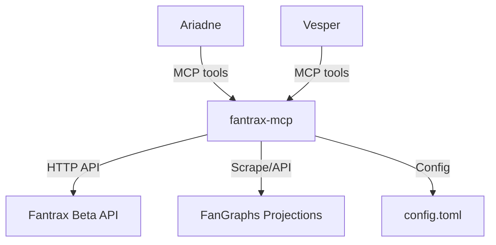
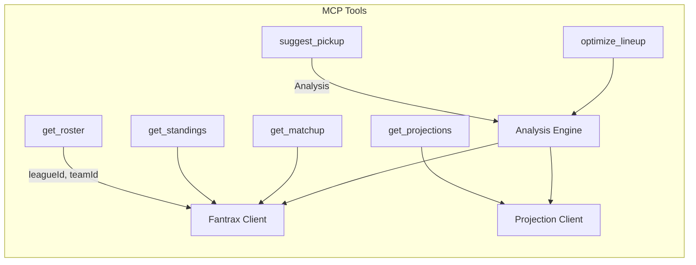
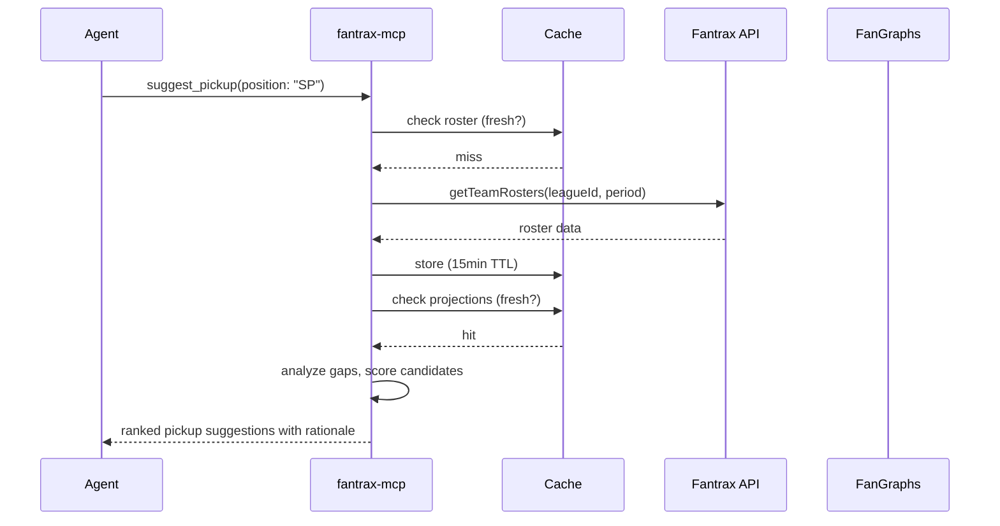

<!-- design-meta
status: draft
last-updated: 2026-05-26
phase: 3
-->

# Architecture: Fantrax Fantasy Baseball MCP Server

## Overview

A Rust MCP server (streamable HTTP via rmcp + Axum) that wraps Fantrax's beta API and third-party projection sources into agent-friendly tools. Read-only. Caches aggressively to minimize external API calls.

## Component Decomposition

### MCP Server (rmcp + Axum)
- Streamable HTTP transport, same pattern as memory-mcp
- Tool dispatch: roster, standings, matchup, projections, suggest_pickup, optimize_lineup

### Fantrax Client
- HTTP client wrapping the beta API endpoints
- Auth: userSecretId passed as query parameter
- Endpoints: getTeamRosters, getStandings, getLeagueInfo, getPlayerIds

### Projection Client
- Pulls player projections from FanGraphs (scraping or API)
- Fallback: Rotowire, Baseball Savant
- Caches projections (refresh daily)

### Analysis Engine
- Scoring rules parser (from getLeagueInfo)
- Roster gap analysis (what categories are you losing?)
- Pickup scorer (project impact of adding player X, dropping player Y)
- Lineup optimizer (start/sit based on matchups and projections)

### Cache Layer
- In-memory cache with TTLs
- Roster/standings: 15-minute TTL (changes slowly)
- Projections: 24-hour TTL (daily refresh)
- Player IDs: 7-day TTL (rarely changes mid-season)

## System Context



## MCP Tools



## Data Flow



## Technology Choices

| Component | Choice | Rationale |
|-----------|--------|-----------|
| Language | Rust | Consistent with memory-mcp, dione ecosystem |
| MCP | rmcp + Axum | Same stack as memory-mcp |
| HTTP client | reqwest | Already in the dependency tree |
| Config | TOML | Consistent with dione/memory-mcp |
| Cache | in-memory HashMap + Instant | Simple, no external deps needed |
| Scraping | reqwest + scraper crate | For FanGraphs if no API available |

## Config Format

```toml
[fantrax]
user_secret_id = "..."
league_id = "..."
team_id = "..."

[projections]
source = "fangraphs"  # or "rotowire"
refresh_hours = 24

[server]
port = 3001
```

Config file at `~/.config/fantrax-mcp/config.toml`, gitignored from repo.
